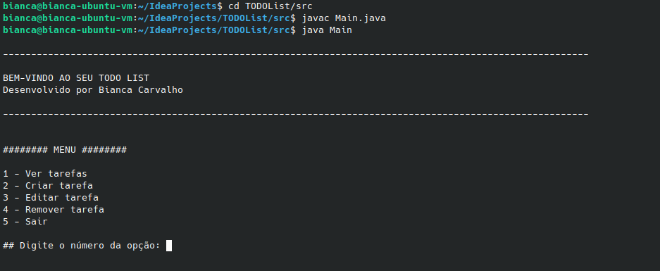

# TODO List - Gerenciador de Tarefas em Java
_**Desenvolvido por Bianca Carvalho**_

---

---

## Sobre o projeto

O projeto foi desenvolvido em Java puro, sem uso de qualquer framework, e, na versão atual, roda via terminal (feito somente o backend)

## Funcionalidades

- **Menu**: Menu com as opções de ver, criar e excluir tarefas.


- **Criar Tarefa**: Permite cadastrar tarefas com:
  - Título*
  - Descrição
  - Data de Término
  - Prioridade (1 a 5)*
  - Categoria (Casa, Faculdade, Trabalho)
  - Status (Todo, Doing, Done)*


- **Balanceamento**: Novas tarefas são adicionadas a lista respeitando a ordenação por prioridade


- **Visualizar lista de tarefas**:
  - Tem opções para visualizar a lista filtrada por Status, Categoria e Prioridade
  - A lista é ordenada por prioridade


- **Atualizar tarefa**: Permite a edição de tarefas (utiliza ID e shallow copy)


- **Remover Tarefa**: Permite a exclusão de tarefas (utiliza ID)


- **Validação de Dados**: Tratamento de exceções para entradas inválidas (fora do TaskService, que é responsável somente pela lógica de manipulação das tarefas), e uso de números para facilitar a identificação e seleção de uma opção pelo usuário

## Mais informações

- Java JDK 17.0.18
- Segue o padrão Git Flow para organização do desenvolvimento do projeto
- Estrutura do projeto:
  - Package `Model`: destinado a definição das entidades, como Task e Status
  - Package `Service`: destinado a lógica de manipulação das tarefas e lista de tarefas
  - `View/Menu`: destinado a interação com o usuário
  - `Main`: ponto de entrada da aplicação

## Como executar

O projeto foi desenvolvido utilizando o Java JDK 17.0.18 na IDE IntelliJ.

Antes tudo é necessário clonar o repositório git:
```bash
git clone https://github.com/biancapcarvalho/TODOList.git
```

### Executar via IntelliJ
Inicie/abra o projeto no IntelliJ, vá no arquivo src/Main.java e execute o programa (shift+f10)

### Executar via terminal
Vá até o diretório `src` dentro do repositório clonado
```bash
cd TODOList/src
```

Compile o arquivo de entrada da aplicação (Main.java)
```bash
javac Main.java
```

Execute a aplicação
```bash
java Main
```

Após isso será exibido no terminal o menu principal daa aplicação, como mostra a tela abaixo.



---

## TODO (planos para o futuro)

- Exibir contagem de tarefas (total, por categoria, status e prioridade)
- Filtrar as tarefas por data de término
- Persistir os dados (csv, json, ect)

E em futuro mais distante mas não tão distante, utilizar banco de dados (postgre) e implementar frontend